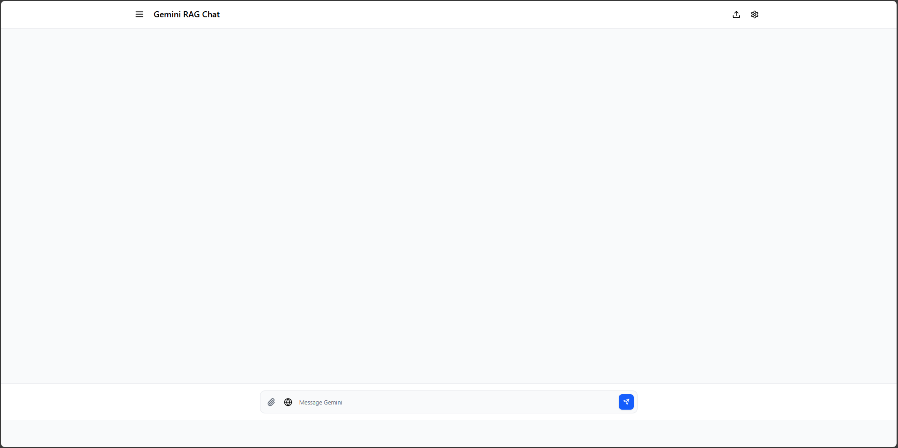

# 📘 Hướng dẫn sử dụng ChatBot

## Mục lục
- [Giới thiệu](#-giới-thiệu)
- [Bắt đầu nhanh](#-bắt-đầu-nhanh)
- [Giao diện người dùng](#-giao-diện-người-dùng)
- [Hướng dẫn sử dụng](#-hướng-dẫn-sử-dụng)
  - [Trò chuyện với AI](#-trò-chuyện-với-ai)
  - [Quản lý tài liệu](#-quản-lý-tài-liệu)
  - [Truy vấn tài liệu (RAG)](#-truy-vấn-tài-liệu-rag)
  - [Tìm kiếm web](#-tìm-kiếm-web)
- [Mẹo và thủ thuật](#-mẹo-và-thủ-thuật)
- [Xử lý sự cố](#-xử-lý-sự-cố)
- [Câu hỏi thường gặp](#-câu-hỏi-thường-gặp-faq)

## 🌟 Giới thiệu

Chào mừng bạn đến với ChatBot - ứng dụng chat thông minh tích hợp AI mạnh mẽ. Với ChatBot, bạn có thể:

- 💬 Trò chuyện thông minh với AI sử dụng Google Gemini
- 📂 Tải lên và quản lý nhiều loại tài liệu khác nhau
- 🔍 Truy vấn thông tin từ tài liệu đã tải lên
- 🌐 Tìm kiếm thông tin mới nhất từ internet

## 🚀 Bắt đầu nhanh

### 1. Cấu hình API Key

1. Lấy API key từ [Google AI Studio](https://makersuite.google.com/app/apikey)
2. Mở ChatBot và nhấp vào biểu tượng ⚙️ (cài đặt)
3. Dán API key vào trường tương ứng
4. Nhấn **Lưu** để áp dụng

### 2. Gửi tin nhắn đầu tiên

1. Nhập câu hỏi hoặc thông điệp vào khung chat
2. Nhấn Enter hoặc nút gửi
3. Chờ AI phản hồi

## 🖥️ Giao diện người dùng

1. **Thanh điều hướng**: Chứa logo và các nút chức năng chính
2. **Danh sách cuộc trò chuyện**: Hiển thị các cuộc hội thoại gần đây
3. **Khung chat**: Hiển thị nội dung cuộc trò chuyện
4. **Thanh công cụ**: Chứa các nút đính kèm file, tìm kiếm web
5. **Khung nhập liệu**: Nơi bạn nhập tin nhắn

## 📝 Hướng dẫn sử dụng

### 💬 Trò chuyện với AI

1. **Gửi tin nhắn thông thường**:
   - Nhập nội dung vào khung chat
   - Nhấn Enter hoặc nút gửi

2. **Định dạng tin nhắn**:
   - Sử dụng Markdown để định dạng văn bản
   - Sử dụng `*in nghiêng*` hoặc `**đậm**`

3. **Dừng phản hồi**:
   - Nhấn nút **Dừng** (■) khi AI đang trả lời

### 📂 Quản lý tài liệu

#### Tải lên tài liệu
1. Nhấp vào nút **Tải lên** trên thanh điều hướng
2. Kéo thả file hoặc nhấp để chọn file từ máy tính
3. Đợi quá trình tải lên hoàn tất

#### Xem danh sách tài liệu
1. Mở bảng điều khiển tài liệu
2. Xem danh sách các file đã tải lên
3. Sử dụng thanh tìm kiếm để lọc file

#### Xóa tài liệu
1. Tìm file cần xóa trong danh sách
2. Nhấn vào biểu tượng thùng rác (🗑️) bên cạnh file
3. Xác nhận thao tác xóa

### 🔍 Truy vấn tài liệu (RAG)

1. Tải lên ít nhất một tài liệu
2. Đặt câu hỏi liên quan đến nội dung tài liệu
3. AI sẽ tự động tìm kiếm thông tin từ các tài liệu đã tải lên

**Mẹo**:
- Hỏi cụ thể để nhận được câu trả lời chính xác hơn
- Bạn có thể tham chiếu đến nội dung cụ thể trong tài liệu

### 🌐 Tìm kiếm web

1. Nhấn nút **Tìm kiếm web** để kích hoạt
2. Nhập câu hỏi hoặc chủ đề cần tìm kiếm
3. AI sẽ tìm kiếm thông tin mới nhất từ internet

## 💡 Mẹo và thủ thuật

- **Phím tắt**:
  - `Enter`: Gửi tin nhắn
  - `Ctrl + Enter`: Xuống dòng mới

- **Tối ưu tìm kiếm**:
  - Sử dụng từ khóa cụ thể
  - Đặt câu hỏi rõ ràng, mạch lạc
  - Kết hợp tìm kiếm web và tài liệu để có kết quả toàn diện

## 🛠️ Xử lý sự cố

### Không thể kết nối
- Kiểm tra kết nối internet
- Đảm bảo backend đang chạy (cổng 8000)
- Xác nhận API key đã được cấu hình đúng

### Lỗi tải lên file
- Kiểm tra định dạng file có được hỗ trợ
- Đảm bảo kích thước file dưới 10MB
- Thử đổi tên file nếu tên có ký tự đặc biệt

### Chất lượng câu trả lời kém
- Làm rõ câu hỏi
- Cung cấp thêm ngữ cảnh nếu cần
- Kiểm tra xem tài liệu liên quan đã được tải lên chưa

## ❓ Câu hỏi thường gặp (FAQ)

### Q: Tôi có thể sử dụng ChatBot miễn phí không?
A: Có, ChatBot là mã nguồn mở và miễn phí, nhưng bạn cần cung cấp API key của riêng mình từ Google AI.

### Q: Tôi có thể sử dụng ChatBot ngoại tuyến không?
A: Không, ChatBot yêu cầu kết nối internet để sử dụng các tính năng AI.

### Q: Làm thế nào để báo cáo lỗi hoặc góp ý?
A: Vui lòng tạo issue mới trên [kho lưu trữ GitHub](https://github.com/TranAnh35/ChatBot) của chúng tôi.

---

📌 **Lưu ý**: Tài liệu này có thể được cập nhật thường xuyên. Vui lòng kiểm tra lại để có thông tin mới nhất.

Chúc bạn có những trải nghiệm tuyệt vời với ChatBot! 🚀